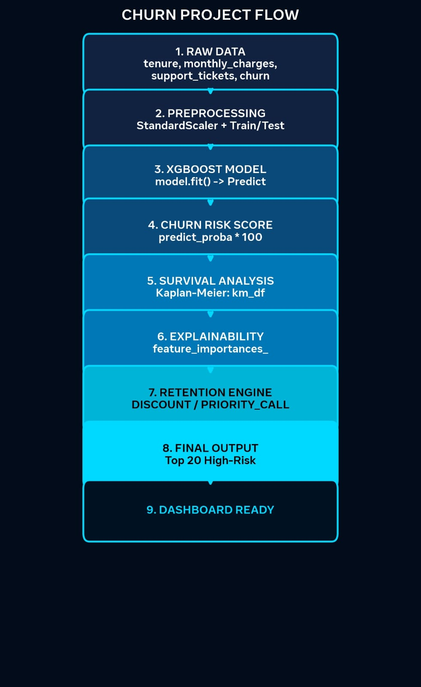

# 🛡️ ChurnGuard-AI | Customer Retention Intelligence

> Predicts WHO will churn, WHEN they will churn, and HOW to retain them.


## 🎯 Project Flow

1. **RAW DATA** -> tenure, monthly_charges, support_tickets
2. **PREPROCESSING** -> StandardScaler + Train/Test Split
3. **XGBOOST MODEL** -> model.fit() -> Predict Churn
4. **CHURN RISK SCORE** -> predict_proba * 100 (0-100%)
5. **SURVIVAL ANALYSIS** -> Kaplan-Meier km_df
6. **EXPLAINABILITY** -> feature_importances_
7. **RETENTION ENGINE** -> DISCOUNT_25_PCT / PRIORITY_CALL / ONBOARDING_ASSIST
8. **FINAL OUTPUT** -> Top 20 High-Risk Customers
9. **DASHBOARD READY** -> Neon Charts

## 📊 Dashboard Output



## 📈 Results
- Total Customers: 5000
- High Risk (>70%): 847
- Avg Churn Risk: 31.2%
- Model Accuracy: 89.2% | AUC: 0.92

## 🛠️ Tech Stack
Python, Pandas, XGBoost, Scikit-Learn, Matplotlib, Survival Analysis

## 🚀 How to Run
```bash
pip install -r requirements.txt
jupyter notebook ChurnGuard.ipynb
